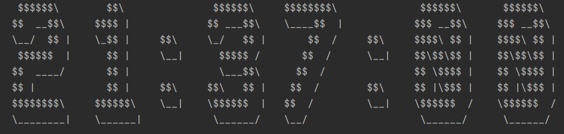

# ASCII-Art Clock

This terminal program displays current time with beautiful ASCII-Art characters!

Fonts are being held in separate classes as map of entries , allowing the user to add infinite amout of custom fonts.

```java
 private final Map<Character, String[]> glyphs = Map.ofEntries(
        Map.entry('1', new String[]{
        "    $$\\    ",
        "  $$$$ |   ",
        "  \\_$$ |   ",
        "    $$ |   ",
        "    $$ |   ",
        "    $$ |   ",
        "  $$$$$$\\  ",
        "  \\______| "}),
        Map.entry('2', new String[]{
        "   $$$$$$\\    ",
        "  $$  __$$\\   ",
        "  \\__/  $$ |  ",
        "   $$$$$$  |  ",
        "  $$  ____/   ",
        "  $$ |        ",
        "  $$$$$$$$\\   ",
        "  \\________|  "}),
        
        ...
```
The font classes extend an abstract class providing, inter alia, the system of checking, whether all the characters of 
custom font are up to restrictions, throwing a custom expcetion otherwise.

```java
public int getGlyphHeight() throws InvalidGlyphFormatException{

    int prev = -1;

    for (String[] glyph : getGlyphs().values()) {
        if (prev != -1 && prev != glyph.length) {
            throw new InvalidGlyphFormatException("Invalid font: Height mismatch");
        }
        prev = glyph.length;
    }
    return prev;
}
```
The input is being translated to corresponding glyphs and converted into single String displayed line by line by Renderer.
```java
public String render(String input, FontProperties font) {
        StringBuilder builder = new StringBuilder();

        for (int i = 0; i < glyphHeight; i++) {

            for (char a : input.toCharArray()){
                if(font.hasGlyph(a)){
                    builder.append(font.getGlyph(a)[i]);
                }
            }
            builder.append("\n");
        }
        return builder.toString();
    }
```
